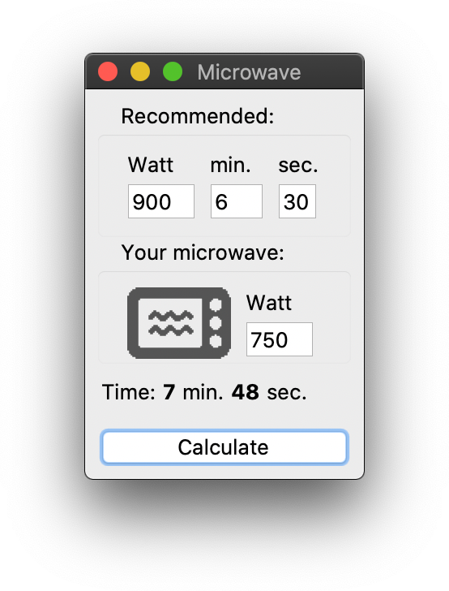

# Microwave Converter
> Python script to calculate the recommended preparation time of a TV dinner
for a microwave oven with a different power (Watt) configuration.

Let's say you have a TV dinner which recommends to be prepared in 6 minutes
and 30 seconds on 900 Watt, but then you realize your own microwave oven only
goes to 750 Watt... Oh no! What now?! Just guess a bit for the correct time?
NO! Be way more precise and use *Microwave Converter!*

Microwave Converter does its calculations based on the total amount of energy
(Joule) so you can easily get close to the optimal preparation time for any
TV dinner with your own (seemingly incompatible) microwave oven.



## Installation

**macOS & Linux:**
Just save the *Microwave* folder to a location of your choosing.

**Windows:**
This script hasn't been tested on Windows, but should work (?) the same as
with Mac & Linux systems.

## Requirements

* [Python 3.7](https://www.python.org "Python's homepage")

To check which version of Python3 you have (if any), open a terminal and type:

```
python3 -V
```

*(Microwave Converter was developed using Python 3.7.5 on macOS Catalina.)*

## Usage

Open a terminal and *cd* to the *Microwave* directory, then execute the
``microwave.py`` file with Python:

```
python3 microwave.py
```

In the *recommended* (upper) section you fill in what the package on the TV
dinner suggests: the power in Watt and the preparation time. Then in the middle
section, next to the image, you fill in the power in Watt of your own
microwave oven and press the *Calculate* button (or ENTER). The script will
then present you the suggested preparation time based on the power of your own
microwave.

Of course the actual optimal settings should be those which are recommended on
the TV dinner's package itself, so set the power of your microwave as close as
it can get to that recommendation and then do the calculation.
In my personal experience this approach seems to work pretty well, but the use
of this method, script and any of the consequences are entirely at your own
risk.

## Release History

* 0.0.1
    * Work in progress.

## Meta

tumtidum

Distributed under the GNU GPLv3 license. See ``LICENSE`` for more information.

[https://github.com/tumtidum](https://github.com/tumtidum)
